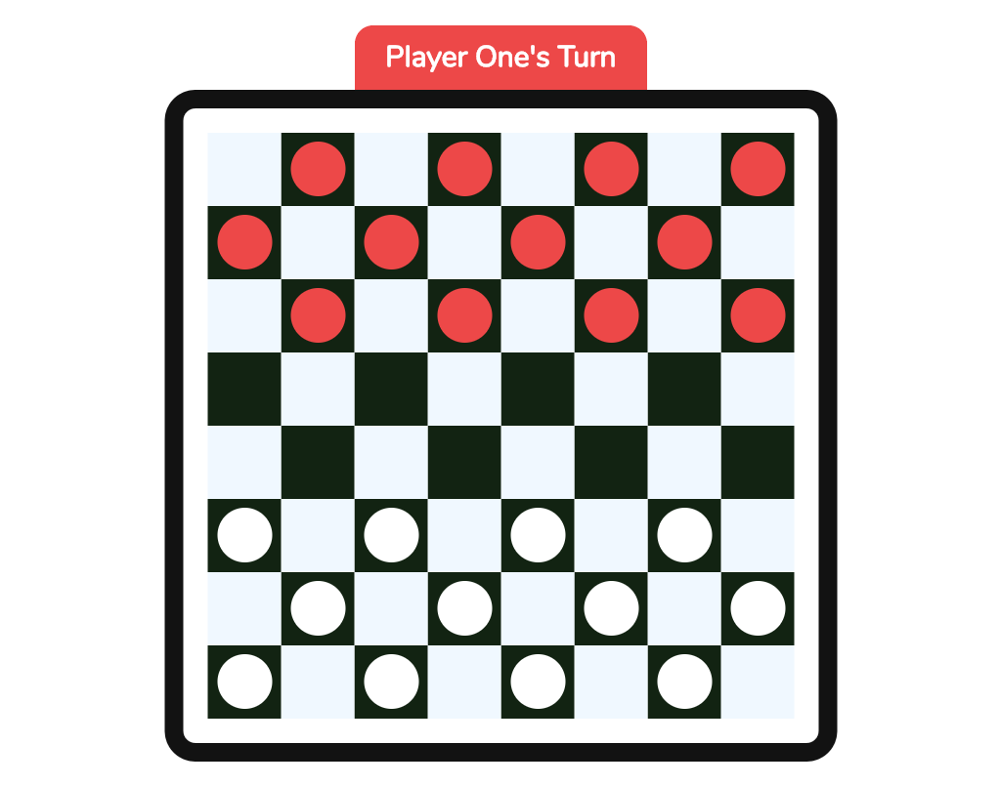

# Checkers Game

This is a simple implementation of the very famous checkers game in React.
[Visit Live Site Here.](https://checkers.now.sh)

#

#

### Features

1. Uses modern ES6-ES7 syntax
2. React for UI
3. React Hooks for better state management
4. Next.js for Server Side Rendering, Fast loading, Automatic code Splitting, Styling with JS.
5. Responsive on almost all devices
6. Clean, tidy and well commented code

#

### Tech Stack

- [React.js - For the UI](https://reactjs.org/)
- [Next.js - For Automatic Code Splitting, SSR, CSS-in-JS, and a lot of cool stuff](https://nextjs.org)
- [Emotion - For Programmatic Styling](https://emotion.sh)

#

### Linting and Formatting

- Prettier
- Eslint

#

### Running Locally (Dev Env)

Follow these steps to run the web app on your local machine

1. Open up your terminal and type: `git clone https://github.com/nfuad/checkers.git`
2. Then enter into the cloned repo from the terminal using: `cd checkers` (assuming the directory name wasn't changed while cloning)
3. Then type: `npm install` to install all the dependencies
4. When the installation is complete, type: `npm run dev`
5. The web app will open up on the default browser

#

### Available Commands / Script Tasks

- `npm run dev` - To start the local development environment
- `npm run build` - To build for production using `next build` command
- `npm run start` - To start in production mode using `next start`
- `npm run export` - To export static files using `next export`

#

### Live Demo

Check out the live demo here:
[https://checkers.now.sh](https://checkers.now.sh)

#

### Bug Report

If you found any bug and want to report it, you can definitely [open a new issue here.](https://github.com/nfuad/checkers/issues)

#

### License

[MIT](/LICENSE.md) -
In other words, this repo is available, for anyone, anywhere, for any kind of use, completely free of cost.
